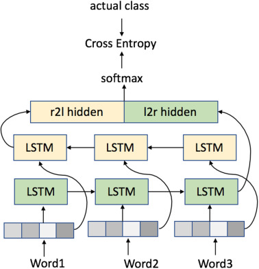
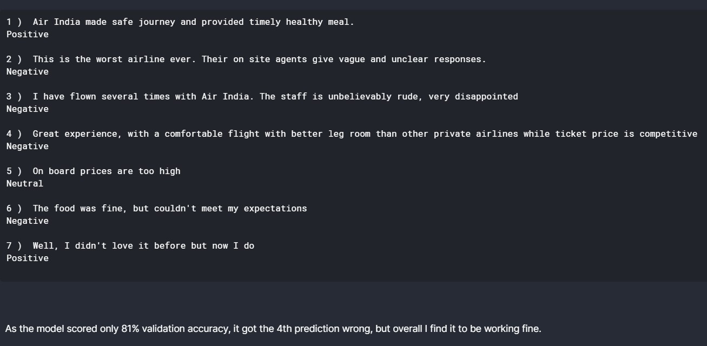

<h1 align="center"><b> Airline Tweet Sentiment Prediction </b></h1>
<h3 align="center"><b> Airline Tweet prediction using LSTMs in Tensorflow </b></h1>

<p align="center"></p>


&nbsp;&nbsp;&nbsp;&nbsp;&nbsp;&nbsp;&nbsp;&nbsp;&nbsp;&nbsp;&nbsp;&nbsp;&nbsp;&nbsp;&nbsp;&nbsp;&nbsp;&nbsp;&nbsp;
&nbsp;&nbsp;&nbsp;&nbsp;&nbsp;&nbsp;&nbsp;&nbsp;&nbsp;&nbsp;&nbsp;&nbsp;&nbsp;&nbsp;&nbsp;&nbsp;&nbsp;&nbsp;&nbsp;&nbsp;


## Background 
This model has been specialized in order to predict the sentiment of a tweet related to any Airline Company. Airlines can use a better version of this model in order to keep track of customer satisfaction without needing any human assistance to classify the customer's sentiment in the tweet.

## Download Dependencies
```bash
pip install numpy
pip install pandas
pip install tensorflow
pip install nltk
pip install re
pip install matplotlib
pip install os
```

## Code 
#### 1. Importing Dependancies
```python
import numpy as np
import pandas as pd
import matplotlib.pyplot as plt

import tensorflow as tf
from tensorflow.keras.layers import Dense,Flatten,Embedding,Bidirectional,LSTM,Dropout,BatchNormalization
from tensorflow.keras.preprocessing.text import Tokenizer
from tensorflow.keras.preprocessing.sequence import pad_sequences

from nltk.corpus import words
from nltk.corpus import stopwords

import re
import os
```

#### 2. Data Preprocessing
```python
for line in df.Text:  #From the text data, which are tweets, I am removing all the words having '@' and 'http' characters because, those words are usernames , and website links and are waste data to the model.
        x = re.findall("[@]\w+", line)
        urls = re.findall('(?:(?:https?|ftp):\/\/)?[\w/\-?=%.]+\.[\w/\-?=%]+', line)
        X = x+urls
        y = line.split()
        resultwords = [word for word in y if word not in X]
        line = ' '.join(resultwords)
        text_list.append(line)
        
nltk.download('stopwords')

sentences=[]                         #Preparing sentences list without stopwords, clean
labels = df.Sentiment.tolist()       #Labels are Sentiment column of the DataFrame
for line in text_list:               #text_list
        for word in stopwords:
            token = " "+word+" "
            line = line.replace(token, " ")
        sentences.append(line)
```

##### 3. Tokenizing and Padding the data
```python
tokenizer = Tokenizer(num_words = vocab_size, oov_token=oov_tok)
tokenizer.fit_on_texts(train_sentences)
word_index = tokenizer.word_index

train_sequences = tokenizer.texts_to_sequences(train_sentences)
train_padded = np.array(pad_sequences(train_sequences,maxlen=max_length,truncating=trunc_type,padding=padding_type))

validation_sequences = tokenizer.texts_to_sequences(validation_sentences)
validation_padded = np.array(pad_sequences(validation_sequences, padding=padding_type, maxlen=max_length))
```
#### 3. Define the model
```python

model = tf.keras.Sequential([
    
    Embedding(vocab_size,embedding_dim,input_length = max_length),
    Bidirectional(LSTM(128)),
    Dropout(0.5),
    BatchNormalization(),
    Dropout(0.5),
    Flatten(),
    Dense(64,activation='relu'),
    Dropout(0.5),
    Dense(3,activation='softmax')
    
])
```

#### 4. Sampling data for testing model
```python
review = ["Air India made safe journey and provided timely healthy meal.",
        "This is the worst airline ever. Their on site agents give vague and unclear responses.",
        "I have flown several times with Air India. The staff is unbelievably rude, very disappointed",
        "Great experience, with a comfortable flight with better leg room than other private airlines while ticket price is competitive",
        "On board prices are too high",
        "The food was fine, but couldn't meet my expectations",
        "Well, I didn't love it before but now I do"] #These are sample testing reviews written by me, it may be edited by the user

review_clean = []
for line in review:             
        for word in stopwords:
            token = " "+word+" "
            line = line.replace(token, " ")
        review_clean.append(line)

a = tokenizer.texts_to_sequences(review_clean)
a1 = np.array(pad_sequences(a, maxlen = max_length, truncating = trunc_type, padding = padding_type))
```

#### 5. Predicting
```python
predictions = model.predict(a1)
for i,p in enumerate(predictions):
    m = max(p)
    print(i+1,") ",review[i])
    if p.tolist().index(m) == 0:
        print("Negative")
    elif p.tolist().index(m) == 1:
        print("Neutral")
    else:
        print("Positive")
    print(" ")
```

## Results 

<p align="center"></p>
